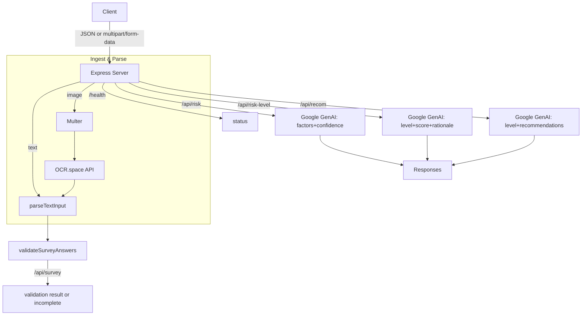
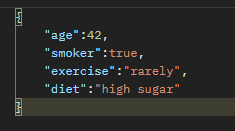

## Health Risk Profiler

An Express.js backend that profiles non-diagnostic health risks from simple lifestyle inputs (age, smoking, exercise, diet). It supports:

- Text or image survey input (image parsed via OCR)
- Risk factor extraction and confidence scoring using Google GenAI
- Simple risk level scoring with rationale and actionable recommendations

> Note: This project is for educational purposes only and is not a medical device. It does not provide medical advice or diagnosis.

---

### Table of Contents
- [Features](#features)
- [Tech Stack](#tech-stack)
- [Architecture](#architecture)
- [Prerequisites](#prerequisites)
- [Local Setup](#local-setup)
- [Environment Variables](#environment-variables)
- [Run](#run)
- [API Reference](#api-reference)
- [Samples (cURL)](#samples-curl)
- [Project Structure](#project-structure)
- [Postman Collection](#postman-collection)
- [Common Issues](#common-issues)
- [Security Notes](#security-notes)
- [License](#license)

---

### Features
- Robust text parsing tolerant to OCR quirks for survey ingestion.
- Image-to-text using OCR.space API.
- Three AI-powered endpoints using Google GenAI (Gemini):
  - Risk factor extraction with confidence.
  - Risk level and score with rationale.
  - Actionable recommendations with simplified risk level.
- Health check endpoint, structured error handling, and 404 handler.

### Tech Stack
- Node.js (ES Modules)
- Express.js
- Multer for file uploads
- OCR.space API (via HTTP) for OCR
- Google GenAI (Gemini) via `@google/genai`
- dotenv for env loading

### Architecture


---

### Prerequisites
- Node.js 18+ (recommended)
- An OCR.space API key
- A Google AI Studio API key (Gemini)

### Local Setup
1. Clone and install dependencies
   ```bash
   git clone <your-repo-url>
   cd ai_backend
   npm install
   ```

2. Create a `.env` file in the project root with the following variables:
   ```env
   PORT=3000
   OCR_SPACE_API_KEY=your_ocr_space_api_key
   GOOGLE_API_KEY=your_google_ai_key
   ```

3. Start the server
   ```bash
   npm start
   ```
   By default the server runs on `http://localhost:3000`.

### Environment Variables
- `PORT` (optional): Port for the HTTP server. Defaults to `3000`.
- `OCR_SPACE_API_KEY` (required for image survey): Key for OCR.space.
- `GOOGLE_API_KEY` (required for AI endpoints): Key for Google AI Studio (Gemini).

> Important: In `app.js`, the Google GenAI client is currently instantiated with a hardcoded key. For production, replace that with `process.env.GOOGLE_API_KEY`.

---

### Run
- Development: `npm start` (uses `nodemon` per `package.json`)
- Health check: `GET /health` should return `{ "status": "ok", "timestamp": "..." }`.

---

## API Reference

Base URL: `http://localhost:3000`

### 1) Health Check
- Method: GET
- Path: `/health`
- Response: `{ status: "ok", timestamp: string }`

### 2) Submit Survey
- Method: POST
- Path: `/api/survey`
- Content Types:
  - `application/json` with field `text` containing raw key:value lines or relaxed JSON-like text.
  - `multipart/form-data` with a single `image` file field (PNG/JPG etc.).
- Normalized fields expected from parsed input: `age`, `smoker`, `exercise`, `diet`.
- Responses:
  - On success: `{ answers: { age:number, smoker:boolean, exercise:string, diet:string }, missing_fields: string[], confidence: number }`
  - If >50% fields missing: `{ status: "incomplete_profile", reason: ">50% fields missing" }`
  - On error: `{ status: "error", message: string }`

### 3) Risk Factors & Confidence (GenAI)
- Method: POST
- Path: `/api/risk`
- Body (JSON): `{ age:number, smoker:boolean|string, exercise:string, diet:string }`
- Response: `{ factors: string[], confidence: number }`

### 4) Risk Level & Score (GenAI)
- Method: POST
- Path: `/api/risk-level`
- Body (JSON): `{ age:number, smoker:boolean|string, exercise:string, diet:string }`
- Response: `{ risk_level: "low"|"medium"|"high", score: number(0..100), rationale: string[] }`

### 5) Recommendations (GenAI)
- Method: POST
- Path: `/api/recom`
- Body (JSON): `{ age:number, smoker:boolean|string, exercise:string, diet:string }`
- Response: `{ risk_level: "low"|"medium"|"high", factors: string[], recommendations: string[], status: "ok" }`

Notes:
- All GenAI endpoints attempt to parse JSON from the model output. If parsing fails or the output is incomplete, the server falls back to a deterministic heuristic to ensure a valid response.

---

## Samples (cURL)

### Submit Survey with Text
```bash
curl -X POST http://localhost:3000/api/survey \
  -d '{
    "text": "age: 52\nsmoker: yes\nexercise: low\ndiet: high sugar"
  }'
```
  ### Submit Survey with Image
  ```bash
  curl -X POST http://localhost:3000/api/survey \
    -F image=@/absolute/path/to/survey.png
  ```
  
  Sample image used for OCR testing:
  
  { width="300" }
  

  ### Get Risk Factors & Confidence
  ```bash
  curl -X POST http://localhost:3000/api/risk \
    -H "Content-Type: application/json" \
  -d '{
    "age": 52,
    "smoker": true,
    "exercise": "low",
    "diet": "high sugar"
{{ ... }}
```

### Get Risk Level & Score
```bash
curl -X POST http://localhost:3000/api/risk-level \
  -H "Content-Type: application/json" \
  -d '{
    "age": 52,
    "smoker": true,
    "exercise": "low",
    "diet": "high sugar"
  }'
```

### Get Recommendations
```bash
curl -X POST http://localhost:3000/api/recom \
  -H "Content-Type: application/json" \
  -d '{
    "age": 52,
    "smoker": true,
    "exercise": "low",
    "diet": "high sugar"
  }'
```

---

## Project Structure
```
ai_backend/
├─ app.js                     # Express app and routes
├─ package.json               # Scripts and deps
├─ .env                       # Environment variables (not committed)
├─ uploads/                   # Temp upload dir (created by Multer)
├─ postman/
│  └─ Health Risk Profiler.postman_collection.json
├─ imagee.png                 # Sample image (if any)
└─ readme.md
```

## Postman Collection
Import `postman/Health Risk Profiler.postman_collection.json` into Postman to try all endpoints.

---

## Common Issues
- OCR returns empty text: Ensure `OCR_SPACE_API_KEY` is valid and you are not rate-limited.
- GenAI endpoints fail: Ensure `GOOGLE_API_KEY` is set and allowed for the selected model (e.g., `gemini-2.5-flash`).
- CORS (if front-end calls this API from the browser): add and configure `cors` middleware.

## Security Notes
- Do not hardcode API keys. Use the `.env` file and `process.env`. In `app.js`, replace the hardcoded Google API key instantiation `new GoogleGenAI({ apiKey: "..." })` with `new GoogleGenAI({ apiKey: process.env.GOOGLE_API_KEY })` for production.
- Never commit `.env` to source control.

## License
MIT